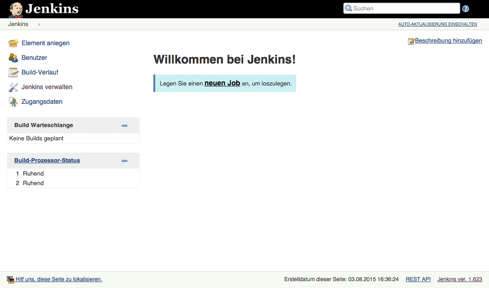

# Jenkins-on-Mesos

Last integration test:

- [Jenkins](http://jenkins-ci.org/) v1.645
- [Mesos-Plugin](https://github.com/jenkinsci/mesos-plugin) v0.9.0
- [Mesos](http://mesos.apache.org/) v0.26.0
- [Mesos-DNS](https://github.com/mesosphere/mesos-dns) v0.5.1
- [Marathon](https://github.com/mesosphere/marathon) v0.10.1

**Default Mesos-Plugin Env. (see [Dockerfile](Dockerfile) and [config.xml](config.xml)):**

```sh
JENKINS_HOME "/var/lib/jenkins"
JENKINS_LOGFILE "/mnt/mesos/sandbox/jenkins.log"
JENKINS_MESOS_NAME "MesosCloud"
JENKINS_MESOS_MASTER "zk://leader.mesos:2181/mesos"
JENKINS_MESOS_DESCRIPTION "Jenkins Schedule"
JENKINS_MESOS_FRAMEWORKNAME "Mesos"
JENKINS_MESOS_SLAVEUSER "root"
JENKINS_MESOS_PRINCIPAL ""
JENKINS_MESOS_SECRET ""
JENKINS_MESOS_ONDEMANDREGISTRATION "false"
JENKINS_MESOS_JENKINSURL "http://jenkins.marathon.mesos:31205"
JENKINS_MESOS_SLAVE_LABEL "mesos"
```

**Marathon Example:**
```sh
curl -X POST -H "Accept: application/json" -H "Content-Type: application/json" \
  leader.mesos:8080/v2/apps -d '{
    "id": "jenkins",
    "container": {
        "type": "DOCKER",
        "docker": {
            "image": "jstabenow/jenkins-mesos:latest"
        },
        "volumes": []
    },
    "cpus": 1,
    "mem": 2048,
    "instances": 1,
    "ports": [
        31205
    ],
    "healthChecks": [
        {
            "path": "/",
            "portIndex": 0,
            "protocol": "HTTP",
            "gracePeriodSeconds": 30,
            "intervalSeconds": 30,
            "timeoutSeconds": 30,
            "maxConsecutiveFailures": 3
        }
    ],
    "upgradeStrategy": {
        "minimumHealthCapacity": 0
    }
}`
```

**Docker-Run Example:**
```sh
docker run -it -p 31205:31205 jstabenow/jenkins-master:latest
```

**UI-Access:** 

"jenkins.marathon.mesos:31205" or "agent-hostname:31205"

**Add your first job:**



**Init persistent data:**

If you want to move the installed Mesos-Plugin into a new Path/Store:

Init the App with:

```sh
{
    "container": {
        "type": "DOCKER",
        "docker": {
            "image": "jstabenow/jenkins-mesos:latest"
        },
        "volumes": [
            {
                "containerPath": "/mnt/jenkins",
                "hostPath": "/mnt/jenkins",
                "mode": "RW"
            }
        ]
    },
    "env": {
        "JENKINS_HOME_NEW": "/mnt/jenkins",
        "RUN": "MOVE"
    }
}
```
And then PUT:
```sh
{
    "container": {
        "type": "DOCKER",
        "docker": {
            "image": "jstabenow/jenkins-mesos:latest"
        },
        "volumes": [
            {
                "containerPath": "/var/lib/jenkins",
                "hostPath": "/mnt/jenkins",
                "mode": "RW"
            }
        ]
    },
    "env": {
        "RUN": ""
    }
}
```
Finished.
